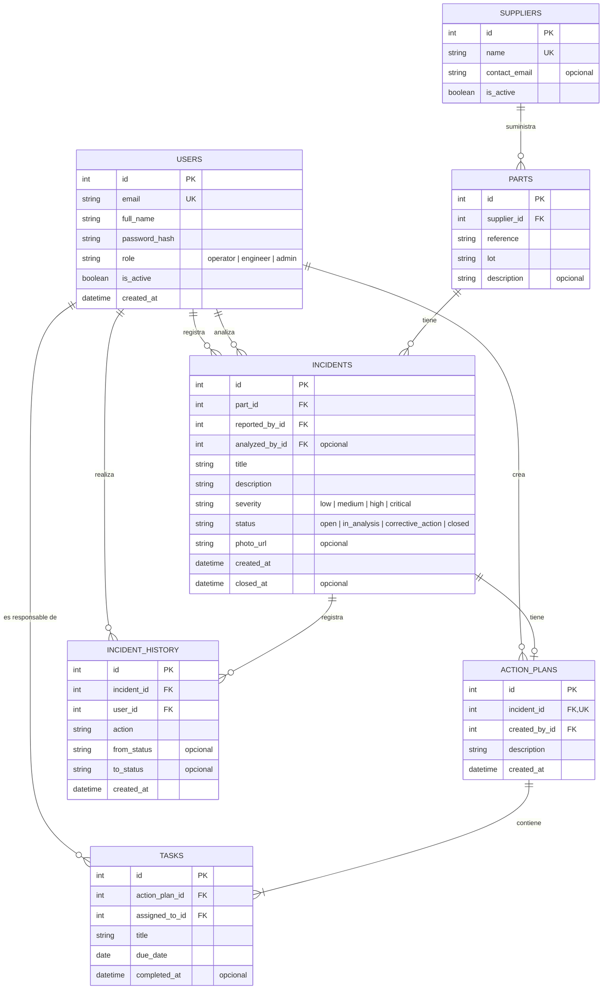

# SupplyGuard: modelo de datos

Diagrama entidad-relación (ER) de la base de datos. Es el diseño previsto para la Fase 1; se actualizará si los modelos cambian al implementarlos.

## Cómo leer el diagrama

- `||--o{` significa "uno a muchos": un proveedor tiene muchas piezas, pero cada pieza es de un solo proveedor.
- `||--o|` significa "uno a cero o uno": una incidencia tiene como máximo un plan de acción.
- `PK` es la clave primaria (identifica cada fila), `FK` es una clave foránea (apunta a una fila de otra tabla) y `UK` indica un valor que no se puede repetir.

## Decisiones de diseño

- **El proveedor de una incidencia se obtiene a través de la pieza** (`incidents → parts → suppliers`). No se guarda dos veces para evitar datos contradictorios. El ranking de proveedores se calcula con ese recorrido.
- **La pieza incluye el lote.** Sigue el planteamiento inicial del proyecto. Si más adelante hace falta separar el catálogo de piezas de los lotes recibidos, se puede crear una tabla `lots`.
- **Una incidencia tiene como máximo un plan de acción.** Por eso `incident_id` es único en `action_plans`.
- **Una tarea está completada si tiene `completed_at`.** No hace falta un campo de estado aparte, y sirve para calcular cuándo se terminó. Una incidencia se puede cerrar cuando todas las tareas de su plan están completadas.
- **El historial no se modifica ni se borra.** Cada cambio de estado o acción importante añade una fila nueva.
- **Las claves foráneas a usuarios terminan en `_id`** (`reported_by_id`, `assigned_to_id`...). Así se distinguen de la relación en Python (`incident.reported_by` devuelve el objeto `User`).
- **Las tareas dependen de su plan:** si se quita una tarea de la lista del plan, se borra. El resto de borrados están bloqueados por las claves foráneas, para no perder historial.
- **Una pieza no se repite:** la combinación proveedor + referencia + lote es única.
- **Estados, gravedades y roles** se guardan como texto con valores fijos en inglés (enumerados en el código, con una restricción `CHECK` en la base de datos), no como tablas aparte.
